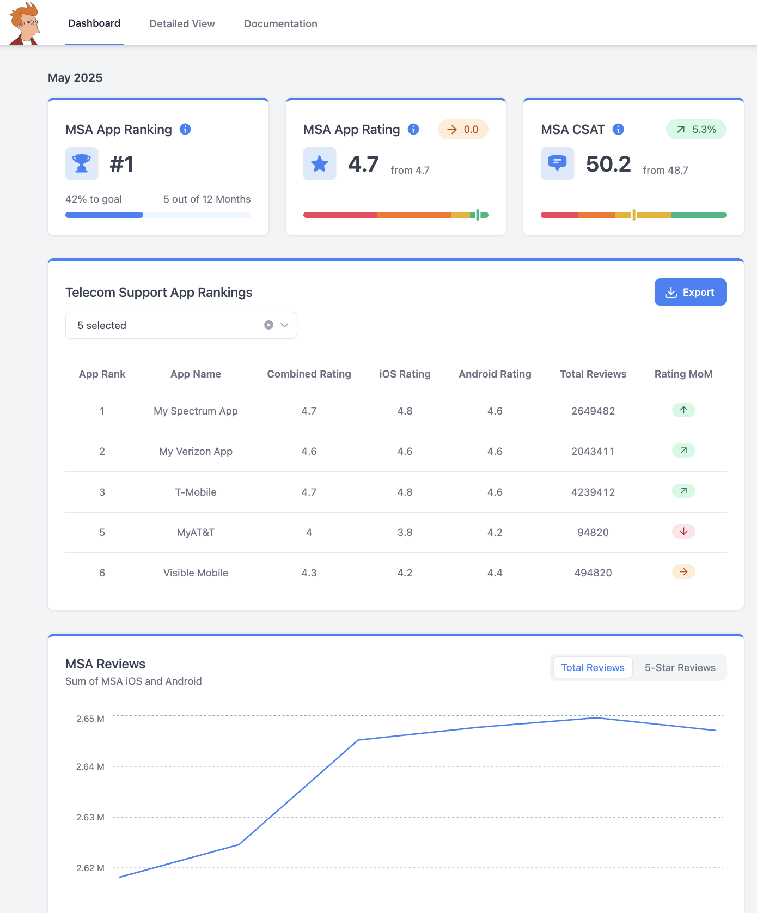
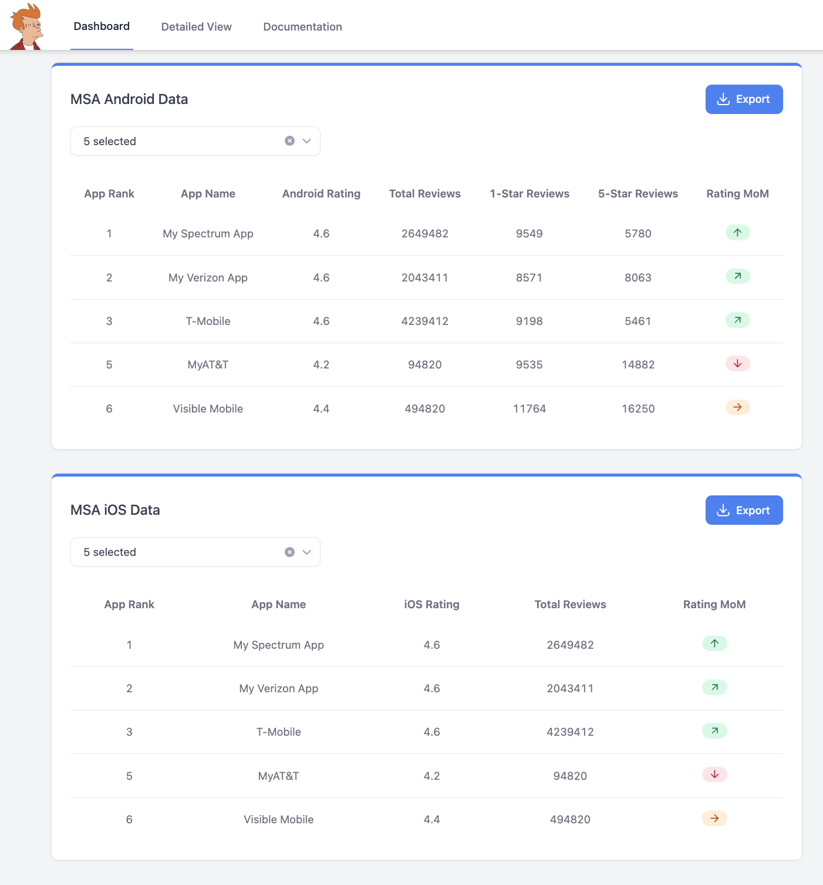
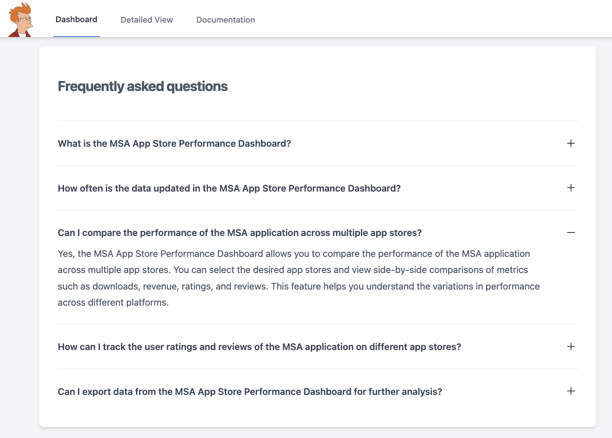

# App Store KPI Dashboard


<div style="display: flex; align-items: center; gap: 20px; flex-wrap: wrap; margin-bottom: 16px;">
    <a href="https://app-kpi-dashboard.vercel.app/" target="_blank" rel="noreferrer">
        
    </a>
    <a href="https://nextjs.org/" target="_blank" rel="noreferrer">
        
    </a>
    <a href="https://tailwindcss.com/" target="_blank" rel="noreferrer">
        
    </a>
    <a href="https://www.typescriptlang.org/" target="_blank" rel="noreferrer">
        
    </a>
</div>

<br>

[App Store KPI Dashboard](https://app-kpi-dashboard.vercel.app/) is a data visualization dashboard designed to provide actionable analytics on the performance of telecom support applications across major app stores. Built with modern web technologies, this project serves as a portfolio showcase of interactive and highly customizable data visualization for business intelligence.

---

## Features

### 📊 Data Visualization

-   **KPI Cards**: Instantly view key metrics such as overall app rating, customer satisfaction (CSAT), and app ranking, with visual cues for trends and changes.
-   **Interactive Tables**: Explore detailed app performance data for both iOS and Android platforms, including combined and platform-specific ratings, review counts, and month-over-month (MoM) changes.
-   **Line Charts**: Analyze trends over time for total reviews and 5-star reviews, with clear, responsive charts.
-   **Category Bars & Progress Bars**: Visualize progress towards goals and distribution of satisfaction scores.

### 🛠️ Customization

-   **Multi-Select Filters**: Select which apps to display in tables and charts, enabling focused analysis on apps of interest.
-   **Responsive Layout**: Optimized for desktop and mobile, with adaptive navigation and layouts.
-   **Theme & Style**: Built with Tailwind CSS for easy customization of colors, spacing, and typography. The dashboard uses a clean, modern design with subtle gradients and shadows.

### 📈 Business Intelligence

-   **Comparative Analysis**: Compare app performance across platforms and over time.
-   **Export Options**: (Planned) Export data in CSV, Excel, or PDF formats for further analysis or reporting.
-   **Documentation & FAQ**: Integrated documentation section to help users understand metrics, features, and usage.

---

## Project Structure

The project follows a structure typical for Next.js applications using the App Router:

```
app/

├─ mainChart.tsx # Line charts for review trends

├─ mainTable.tsx # Combined app performance table

├─ sectionKPI.tsx # KPI summary cards

├─ rankKPI.tsx # App ranking KPI card

├─ ratingKPI.tsx # App rating & CSAT KPI cards

├─ navbar.tsx # Responsive navigation bar

├─ detailed_view/

│ ├─ androidTable.tsx # Android-specific app data

│ ├─ iosTable.tsx # iOS-specific app data

│ └─ page.tsx # Detailed view page

├─ documentation/

│ ├─ faq.tsx # FAQ accordion

│ └─ page.tsx # Documentation page

├─ layout.tsx # Root layout and global styles

├─ page.tsx # Main dashboard page

└─ globals.css # Tailwind and custom styles

```
---

## Customization

The dashboard is designed to be easily customizable:

-   **Add/Remove Apps**: Modify the `combinedTable` data arrays (typically found within the table components or a shared data file) to add new apps or update metrics.
-   **Change KPI Metrics**: Update the `CategoriesRating` and `CategoriesRank` arrays or similar data structures in [`app/sectionKPI.tsx`](app/sectionKPI.tsx) to customize which KPIs are displayed on the summary cards.
-   **Styling**: Adjust Tailwind CSS utility classes directly in the components or extend the theme in [`tailwind.config.ts`](tailwind.config.ts) for branding, color scheme changes, or typography adjustments.
-   **Component Reuse**: All visualization components (charts, tables, KPI cards) are modular and can be reused or extended for new data sources or different metrics.

---

## Screenshots

Below are sample images demonstrating the dashboard's interactive data visualizations and customization features:

| Homepage                                   | Detailed View                                        | FAQ & Docs                               |
| :----------------------------------------- | :--------------------------------------------------- | :--------------------------------------- |
|       |       |        |

---

## Getting Started

To set up and run the dashboard locally, follow these steps:

1.  **Clone the repository:**
    ```bash
    git clone <your-repository-url>
    cd <repository-directory>
    ```

2.  **Install dependencies:**
    ```bash
    npm install
    # or
    # yarn install
    # or
    # pnpm install
    ```

3.  **Run the development server:**
    ```bash
    npm run dev
    # or
    # yarn dev
    # or
    # pnpm dev
    ```

4.  Open [http://localhost:3000](http://localhost:3000) in your browser to view the application.

---

## Technologies Used

-   **Next.js**: A powerful React framework for building full-stack web applications. Used here for server-side rendering, static site generation, routing (App Router), and an optimized developer experience.
-   **Tremor**: A modern UI component library specifically designed for building dashboards with React. It provides pre-built charts, cards, and tables that are easy to integrate and customize.
-   **Tailwind CSS**: A utility-first CSS framework that enables rapid development of custom user interfaces directly in your markup.
-   **Heroicons**: A set of high-quality, handcrafted SVG icons by the makers of Tailwind CSS, used for iconography throughout the application.
-   **TypeScript**: A superset of JavaScript that adds static typing. This helps in catching errors early, improving code quality, and making the codebase more maintainable and scalable.

---

## Learn More

To learn more about the core technologies used in this project, refer to their official documentation:

-   [Next.js Documentation](https://nextjs.org/docs) - learn about Next.js features and API.
-   [Tremor Documentation](https://www.tremor.so/docs) - explore Tremor components and usage.
-   [Tailwind CSS Documentation](https://tailwindcss.com/docs) - discover how to use Tailwind CSS.
-   [TypeScript Handbook](https://www.typescriptlang.org/docs/handbook/) - understand TypeScript features.

---

## Deployment

This application is optimized for deployment on [Vercel](https://vercel.com/), the platform by the creators of Next.js.

[](https://vercel.com/new?utm_medium=default-template&filter=next.js&utm_source=create-next-app&utm_campaign=create-next-app-readme)

Click the button above to deploy your own instance of this dashboard.

---

## License

This project is intended for portfolio and demonstration purposes. Please refer to the `LICENSE` file if included in the repository, or assume it is offered as-is for personal viewing and learning unless otherwise specified.
